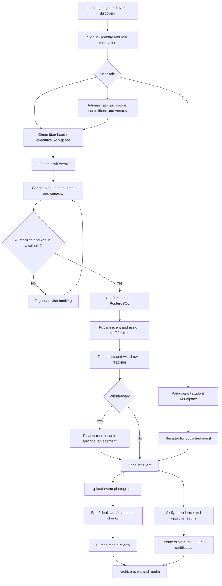
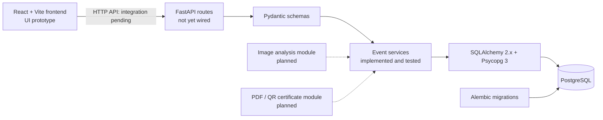
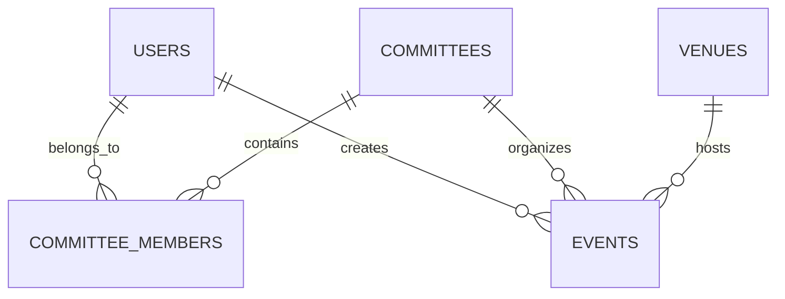

strade

**Behind every great event.**

**A unified college event operations platform — from planning and venue allocation to committee coordination, media review, and verifiable certificates.**

> **BRAIN2BUILD 2026 | Open Innovation | Amritsar Group of Colleges**  
> **Project status (9 October 2026):** Frontend interface/prototype developed; PostgreSQL scheduling engine and Python event-creation service tested. Full API integration and advanced workflows are in development.

---

## Contents

1. [The problem](#the-problem)
2. [Our solution](#our-solution)
3. [Five priority features](#five-priority-features)
4. [Complete end-to-end workflow](#complete-end-to-end-workflow)
5. [User roles](#user-roles)
6. [Architecture and technology](#architecture-and-technology)
7. [Database design](#database-design)
8. [What works today](#what-works-today)
9. [Local development](#local-development)
10. [Demo and evaluation walkthrough](#demo-and-evaluation-walkthrough)
11. [Roadmap](#roadmap)
12. [Business model and revenue vision](#business-model-and-revenue-vision)
13. [Team](#team)

## The problem

Organizing a college event is an operational challenge, not merely creating a poster or a registration link. Information is often scattered across WhatsApp groups, spreadsheets, forms, personal photo folders, and manually prepared certificates. This can lead to:

- **Venue collisions:** multiple committees request the same room or auditorium at overlapping times.
- **Disconnected teams:** faculty, committees, student coordinators, volunteers and participants lack one authoritative view.
- **Last-minute disruption:** withdrawal of a coordinator/volunteer creates untracked gaps in responsibility.
- **Media overload:** hundreds of event images require manual quality checking, deduplication and organization.
- **Certificate workload:** attendance, winners and certificate eligibility can require repetitive manual checking.

**Estrade's thesis:** every successful event needs a reliable operational system behind it.

## Our solution

**Estrade** is a **web-first event operations workspace** for colleges. It unifies event discovery, committee management, venue scheduling, participant and volunteer coordination, media review and certificate issuance across the event lifecycle.

Unlike a basic event listing website, Estrade is designed to answer the day-of-event questions: *Who is responsible? Where and when is the event? Is the venue available? What changed? Who needs replacing? Which photographs are usable? Who is eligible for a certificate?*

## Five priority features

> The five features below describe our **product priorities**, not five fully shipped modules. Current implementation status is shown explicitly.

### 1. Smart Event Media Manager — priority AI-assisted workflow
**Status: UI/showcase developed; analysis pipeline not yet verified end to end.**

- Upload event photographs through authorized event workspaces.
- Classify photos with GPS/EXIF metadata separately from photos without location metadata, without exposing private coordinates publicly.
- Flag technically damaged or blurry photographs using image-quality measures (for example, OpenCV-based blur checks).
- Flag likely duplicate or near-duplicate photographs using cryptographic/perceptual hashes.
- Provide **human review** before images are finally accepted, rejected or published.
- Keep image files outside PostgreSQL and store their metadata, hashes, ownership and moderation status in the database.

**Why it matters:** teams spend less time manually sorting photos and more time selecting the best event coverage. "AI" describes the planned assistance; no trained model accuracy or automatic rejection performance is claimed yet.

### 2. Verified E-Certificate Generator
**Status: Planned; PDF generation and verification not yet demonstrated.**

- Create branded participation, volunteering and winner certificates using event-approved templates.
- Issue certificates **only after attendance verification or an approved award**; registration alone is not proof of attendance.
- Embed a unique verification reference/QR code linking to a validation page.
- Support re-download, authorized revocation, and an audit history.

**Why it matters:** consistent certificates with traceable eligibility and simpler verification.

### 3. Committee Workspaces & Volunteer Coordination
**Status: Committee/membership database models and event-create permissions tested; operational workspaces/withdrawal recovery not yet integrated.**

- Separate workspaces for committees, with approved heads, executives, coordinators and members.
- View upcoming, ongoing and past events, faculty supervision, staffing and readiness checklists.
- Assign event duties to teachers and student coordinators while distinguishing **staff**, **performers**, and **participants**.
- Allow volunteers to request withdrawal; keep a history of approvals, open vacancies and accepted replacements.
- Present suitable **replacement candidates** based on availability and appropriate permissions (planned; not currently an active recommendation engine).

**Why it matters:** ownership and responsibility remain clear even when event plans change.

### 4. Conflict-Free Venue & Event Scheduling
**Status: IMPLEMENTED AND TESTED through PostgreSQL + Python service. No public event-creation HTTP endpoint yet.**

- Create draft or confirmed events for valid committees and active venues.
- Permit creation only by administrators or approved heads/executives of that committee.
- Validate start/end timestamps and the venue's configured capacity.
- Reject overlapping **confirmed** bookings in the **same venue**.
- Allow adjacent bookings (one event begins exactly when another ends), simultaneous bookings in different venues, and overlapping drafts.
- Enforce the no-overlap rule **inside PostgreSQL**, not just with frontend or service checks, using a GiST exclusion constraint.

**Why it matters:** protects the source of truth against competing bookings and avoids double allocation of shared college facilities.

### 5. Unified Role-Aware Event Dashboard
**Status: Landing page, faculty dashboard/navigation and sample-data sections developed as frontend UI; live API-backed dashboard not yet verified.**

- **Faculty/committee dashboard:** schedules, event readiness, staffing, withdrawals and approvals.
- **Student coordinator view:** assigned event, venue, duty, reporting time and supervising teacher.
- **Participant view:** discover published events, register, see relevant schedules and later retrieve certificates.
- **Administrator view:** govern users, committees, venues and high-trust role approvals.
- Dashboard cards already prototyped include event statistics, upcoming events, readiness status and withdrawal alerts; some currently use sample data.

**Why it matters:** each role gets an operational view rather than a collection of disconnected chats.

---

## Complete end-to-end workflow

The following illustrates the **target full application experience**. Only the scheduling/service segment has been verified with live database-backed integration tests.



### Walkthrough: beginning to end

1. **Discover and access:** visitors arrive on the Estrade landing page; users sign in to the appropriate workspace (secure authentication is next to implement).
2. **Establish governance:** an administrator creates venues and committees, provisions trusted roles, and committee executives approve coordinators.
3. **Propose an event:** an approved committee head/executive enters the event details, venue, start/end times, capacity and initial draft/confirmed state.
4. **Safely reserve the venue:** the service checks actor authority, committee existence, active venue, capacity and overlapping confirmed bookings. A PostgreSQL exclusion constraint rejects conflicting inserts even if requests race.
5. **Publish and prepare:** after approval, the event appears to appropriate audiences; organizers allocate faculty, duties, coordinators, volunteers and performers.
6. **Track readiness:** a dashboard highlights preparation progress and missing assignments; a withdrawal creates a recorded request, vacancy and replacement workflow rather than silently deleting history.
7. **Manage participation:** students register; participation, actual attendance, performance, staff duties and awards are separate records and statuses.
8. **Run the event:** faculty confirm attendance and validate outcomes; authorized media staff upload photographs.
9. **Review media:** the media manager flags blur, near-duplicates and optional EXIF/location classification; a person makes final publication decisions.
10. **Issue certificates and archive:** after verified attendance or approved awards, certificates are generated with verification references; the event and its records move into the historical archive.

**Implemented today:** the event-creation **service** and database rules in steps 3–4. All other workflow stages are product design or frontend prototypes unless separately verified.

## User roles

| Role | Intended permissions / workspace |
| --- | --- |
| Administrator | System governance, trusted-role provisioning, committees and venues |
| Committee head / executive | Draft, confirm and manage events for an approved committee; coordinate staff and readiness |
| Faculty / supervisor | View assignments; validate attendance, results and approvals as authorized |
| Student coordinator / volunteer | View own duties, report progress, request withdrawal and upload media when permitted |
| Participant | Discover/register for public events; view personal schedule and eligible certificates |

**Important domain distinction:** being registered, attending, performing, coordinating and winning are **not equivalent**. Estrade models them separately to avoid accidental access or certificate issuance.

## Architecture and technology

Estrade is planned as a **responsive React web application backed by a modular Python monolith**, not a collection of microservices.



| Layer | Technology | Notes |
| --- | --- | --- |
| Frontend | React, Vite | Landing page and faculty dashboard UI prototyped by frontend team |
| API | FastAPI | Planned routes/integration; event HTTP endpoints not yet verified |
| Validation | Pydantic | `EventCreate` and `EventResponse` available locally |
| Business logic | Python 3.14 | Permission, venue and overlap checks tested |
| ORM / database driver | SQLAlchemy 2.x, Psycopg 3 | Connected to PostgreSQL |
| Database | PostgreSQL | `estrade` local database with working migrations/constraints |
| Migrations | Alembic | Application tables and custom exclusion constraint |
| Media assistance | OpenCV and image hashing (proposed) | Not verified as working |
| Certificates | PDF + QR verification (proposed) | Not verified as working |
| Development | Git, GitHub, local Python venv | Team collaboration and source control |

### Booking safety in detail

For an existing confirmed event and a requested confirmed event in the same venue, a clash exists when:

```text
existing.starts_at < requested.ends_at
AND
existing.ends_at > requested.starts_at
```

The database then provides the final protection:

```sql
-- Present in the existing Alembic migration; shown for explanation only.
EXCLUDE USING gist (
    venue_id WITH =,
    tstzrange(starts_at, ends_at, '[)') WITH &&
)
WHERE (status = 'confirmed')
```

The **`[)` half-open interval** permits back-to-back events. The PostgreSQL `23P01` exclusion violation is mapped to a venue conflict in the Python service. Avoid running this DDL manually again if the migration has already applied.

## Database design

**Core implemented tables (5):**

| Table | Purpose |
| --- | --- |
| `users` | Identity, user type and account activation |
| `committees` | College committee identities |
| `committee_members` | User–committee membership, scoped role and verification |
| `venues` | Bookable spaces and positive capacity |
| `events` | Event, committee, venue, creator, schedule and status |



**Next domain entities:** event registrations, event staff, duties, duty assignments, withdrawal requests, performances, attendance/award verification, media assets, certificates, role requests and audit history. These are planned, not existing tables.

## What works today

**As of the current elimination-round checkpoint (9 October 2026):**

| Capability | Evidence / state |
| --- | --- |
| PostgreSQL connection | Verified `Connected to: estrade` |
| Five core ORM tables + Alembic migrations | Built; migration-backed schema |
| No-overlap venue constraint | Present and exercised in PostgreSQL |
| Scheduling SQL smoke tests | **4 of 4 passed**: overlap denied, adjacent accepted, different venue accepted, draft overlap accepted |
| Event creation through Python service | **6 of 6 integration checks passed**: authorized insert, overlap denial, adjacency, other venue, draft overlap, unauthorized actor |
| Pydantic / event-service imports | Both imported successfully |
| Landing page and faculty dashboard | Frontend developer reports UI developed, with sample-data sections |
| Secure login / JWT | Not yet implemented/verified |
| Public `POST /api/v1/events` and dashboard APIs | Not yet implemented/verified |
| React-to-PostgreSQL end-to-end event flow | Not yet verified |
| Media AI / certificates | Planned / integration pending |

> **Testing note:** the SQL and Python integration checks used real PostgreSQL operations and transactional cleanup; they are not a claim of production load testing, a deployed public API, or completed concurrency stress tests.

## Local development

### Backend

```bash
# From the repository root
cd backend

# Activate an existing Python environment
source .venv/bin/activate

# If setting up a fresh clone instead:
# python3 -m venv .venv
# source .venv/bin/activate
# Install project dependencies according to the backend's dependency manifest.
# Provision a local PostgreSQL database and private .env settings.
# Do not commit secrets.

# Check schema migration state (with environment configured)
alembic current
alembic heads

# Check service imports
python -c 'from app.schemas.event import EventCreate; print("Schema OK")'
python -c 'from app.services.event_service import create_event; print("Event service ready")'

# Run the SQL scheduling smoke tests
psql -X -h localhost -U estrade_app -d estrade \
  -v ON_ERROR_STOP=1 -f tests/test_scheduling.sql

# Run service-level tests, if the integration test script is in this checkout
PYTHONPATH=. python tests/check_event_service.py
```

**Environment caveat:** the ZIP snapshot predates the locally added schema/service/test files. Push your latest local files before expecting every command above to work on a new checkout. Database passwords and tokens should remain in `.env` or secure deployment secrets, not in Git.

### Frontend

```bash
cd frontend
npm install
npm run dev
```

The frontend developer reported a Vite development preview at `http://localhost:5173/` and a dashboard route at `http://localhost:5173/dashboard`. These addresses apply only if the frontend folder and dev-server configuration are present in the checkout.

## Demo and evaluation walkthrough

A suggested **four-minute** elimination-round presentation:

1. **Problem (30 s):** colleges coordinate events across groups, spreadsheets and manual processes; scheduling and handoffs can fail.
2. **Product (45 s):** show the landing page and faculty dashboard. Clearly label readiness cards and event stats as UI/sample data where applicable.
3. **Working technical proof (90 s):** explain a committee head requesting a confirmed venue booking, show real SQL/service test results, then show why an overlapping request is rejected but a different venue or adjacent slot succeeds.
4. **Five-feature roadmap (45 s):** introduce the media manager, verified certificates, committee workspaces, conflict-free scheduling and role-aware dashboard; separate working modules from planned capabilities.
5. **Adoption and commercial vision (30 s):** start with a college pilot, validate impact, then evaluate a B2B institutional subscription.

**One-line pitch:** *“Estrade is the operating workspace behind college events: one place to plan, allocate venues without clashes, coordinate people, organize media and issue verifiable certificates.”*

**Mentor-friendly honesty:** we can demonstrate database-backed scheduling today; authentication, web API integration, media automation and certificates are the next development milestones.

## Roadmap

### Phase 1 — Hackathon MVP
- [x] Design core PostgreSQL models and Alembic migrations.
- [x] Implement and test database-level venue clash protection.
- [x] Implement and test committee-authorized event creation service.
- [x] Develop frontend landing page / faculty dashboard UI prototype (frontend-team reported).
- [ ] Implement JWT authentication with server-verified actor identity.
- [ ] Expose protected event list/create and conflict-check HTTP routes.
- [ ] Connect real events to the React dashboard.
- [ ] Build a genuine end-to-end interactive event-booking demo.

### Phase 2 — Event operations
- [ ] Committee management API and approval workflows.
- [ ] Participant registration, staffing and duty assignment.
- [ ] Event readiness tracking and volunteer withdrawal/replacement history.
- [ ] Attendance verification and approval of awards.

### Phase 3 — Media and certificates
- [ ] Media upload/storage pipeline, quality flags and human review.
- [ ] Duplicate/near-duplicate detection and optional privacy-conscious EXIF classification.
- [ ] PDF certificate generation with QR-based verification and revocation.

### Phase 4 — Institutional platform
- [ ] Multi-campus organization and permission boundaries.
- [ ] Audit logs, notifications, reporting and event analytics.
- [ ] Deployment, monitoring, backup/recovery, accessibility and security review.
- [ ] Pilot with an institution and measure operational improvements before scaling.

## Business model and revenue vision

**Commercial direction (hypotheses, not existing revenue):** Estrade could become a **B2B SaaS product for colleges, universities, student organizations and campus event teams**.

| Potential revenue stream | Value proposition | Stage |
| --- | --- | --- |
| Institutional subscription | Annual or semester plans for committee workspaces, scheduling and event operations | Future experiment |
| Tiered campus plans | Pricing based on institution scale, active committees, users and advanced permissions | Future experiment |
| Premium media workflows | Optional larger media storage, bulk processing, review automation and archival policies | Future experiment |
| Certificates and verification | Premium branded templates, bulk issuance and institutional verification features | Future experiment |
| Enterprise / white-label | Campus branding, custom integrations, audit features and support agreements | Future experiment |
| Event-service partnerships | Optional integrations or service fees with approved ticketing, printing and event partners | Long-term option |

### Go-to-market strategy

1. **Pilot at one college:** let real event committees use conflict-free scheduling and collect qualitative feedback.
2. **Measure outcomes:** number of booking collisions prevented, organizer time saved, onboarding friction and usage retention.
3. **Prove reliability:** deliver role-based controls, secure data handling and support before wider adoption.
4. **Expand institution-to-institution:** offer an optional managed onboarding and subscription model once willingness to pay is validated.
5. **Add paid modules selectively:** avoid charging for core student access or monetizing student personal data.

**Revenue claims:** no customers, subscription revenue, market-size figures or pricing validation are claimed at this stage. These are possible models to test after pilots.

## Team

| Member | Primary responsibility |
| --- | --- |
| **Vaibhav Singh Rathore** | Backend, SQLAlchemy/Alembic, PostgreSQL architecture, scheduling, authorization and integrations |
| **Rupinder** | React frontend, UI/UX, landing page, faculty dashboard and API integration |
| **Sandeep** | Media analysis, image-quality and duplicate-detection development |
| **Vanshika** | QA, test data, demo preparation, certificate design and validation |

## Project principles

- **Demonstrate, don't exaggerate.** Prototype screens are not the same as working API-integrated features.
- **Enforce critical invariants in the database.** A frontend warning alone cannot guarantee safe reservations.
- **Verify trusted roles.** Nobody can grant themselves committee authority through a user-controlled form.
- **Keep human review in consequential workflows.** Image flags, attendance and award approval require traceable decisions.
- **Protect participant data.** Limit access to ID evidence, EXIF coordinates and personal records; never commit secrets.
- **Build incrementally.** Begin with one reliable event-creation flow and expand across the lifecycle.

---

<p align="center"><strong>e
